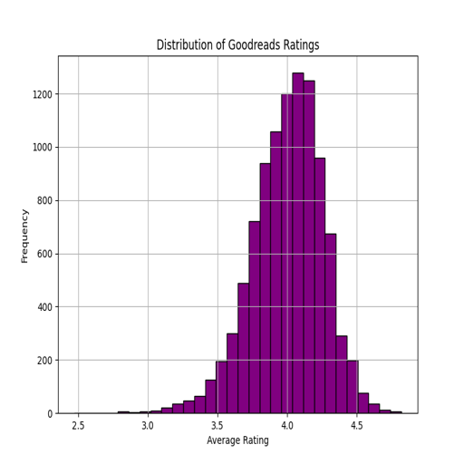
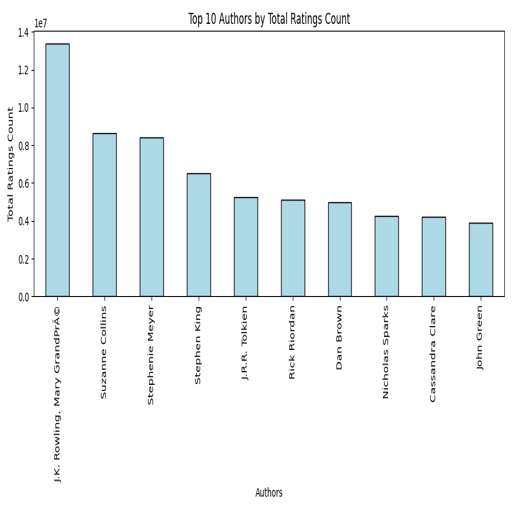
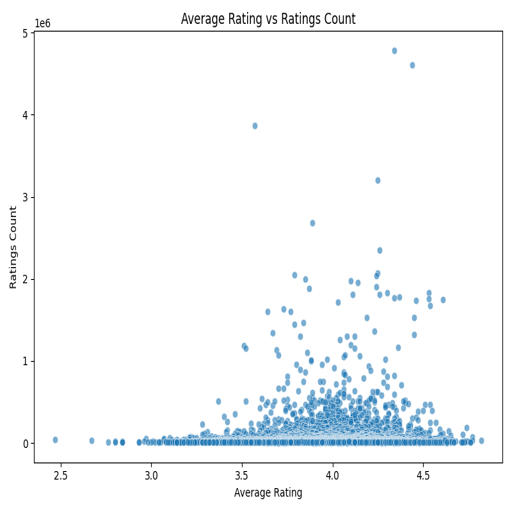
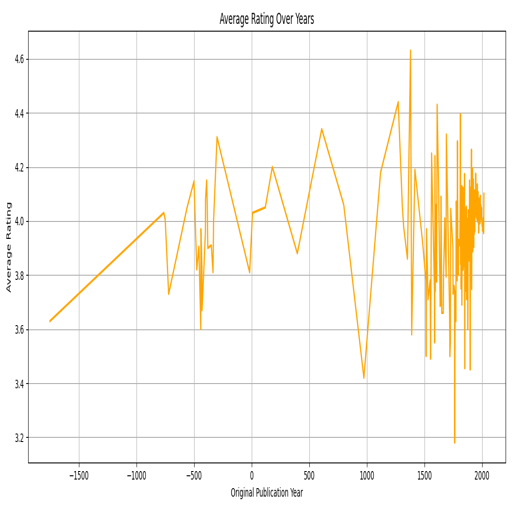

# Goodreads Dataset Analysis

## Introduction

The Goodreads dataset analysis was conducted to explore the preferences and behaviors of readers on one of the world’s most popular platforms for book enthusiasts. By examining a dataset containing 10,000 entries and 23 attributes, the study aimed to uncover trends in book ratings, author popularity, publication patterns, and overall reader sentiment.

## Dataset Overview

The dataset provided extensive information about individual books, including:

- **Key Columns**: book_id, authors, original_publication_year, average_rating, and rating counts across five categories.
- **Missing Data**: Some columns, such as isbn, isbn13, original_publication_year, and original_title, had missing values, which were addressed through data cleaning processes.
- **Ratings Distribution**: Detailed breakdowns of reader ratings (1 to 5 stars), offering a granular view of reader sentiment.

## Statistical Highlights

A preliminary analysis of the dataset yielded these findings:

- **Average Rating**: The mean rating was 4.00 out of 5, with a standard deviation of 0.25, indicating generally favorable and consistent reader feedback.
- **Popularity Disparities**: While some books garnered millions of ratings, others had significantly fewer, highlighting disparities in reader engagement.
- **Publication Years**: The average publication year was 1982, with entries spanning from 1750 to 2017. This range illustrates the enduring appeal of both classic and contemporary works.

## Visualization Insights

Several visualizations were created to provide a deeper understanding of the dataset:

### 1. Ratings Distribution
A histogram of Goodreads ratings showed a strong skew towards higher ratings (4 and 5 stars), confirming a general trend of positive sentiment among readers.

### 2. Top Authors
An analysis of the most popular authors, based on total ratings received, highlighted figures like J.K. Rowling and Suzanne Collins. These authors dominate reader engagement and discussions within the Goodreads community.

### 3. Ratings vs. Ratings Count
A scatter plot of average_rating against ratings_count revealed:
- A positive correlation: Books with higher ratings often had more ratings.
- Outliers: Certain books received high ratings but had low engagement, possibly due to niche appeal or limited exposure.

### 4. Rating Trends Over Time
A line graph showed how average ratings have changed over publication years. Recent publications generally received higher ratings, suggesting evolving tastes or changing rating behaviors among readers.

## Key Insights

From the analysis, several important themes emerged:

- **Positive Reader Sentiment**: High ratings across the board suggest readers often gravitate toward well-reviewed or personally appealing books.
- **Impact of Popular Authors**: The dominance of specific authors underscores the role of branding, community presence, and marketing in shaping book visibility and success.
- **Engagement Gaps**: The disparity in ratings distribution calls attention to the challenge lesser-known authors face in gaining traction.
- **Evolving Preferences**: Newer publications’ higher ratings point to shifting literary tastes or external influences, such as the rise of social media recommendations.

## Implications

- **For Authors**: Leveraging community engagement and strong marketing campaigns can significantly boost a book’s visibility and ratings.
- **For Publishers**: Understanding trends in reader preferences can help guide editorial and promotional strategies.
- **For Researchers**: This dataset offers a rich resource for studying the intersection of literature, marketing, and reader behavior.

## Conclusion

The Goodreads dataset analysis has provided valuable insights into the dynamics of reader preferences, the role of popular authors, and temporal trends in literature. By exploring these themes, stakeholders can better align their strategies to meet the evolving demands of readers.

## Visualizations

Below are the visualizations created during the analysis:

- 
- 
- 
- 

