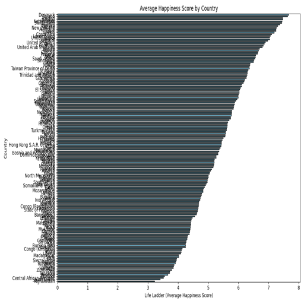
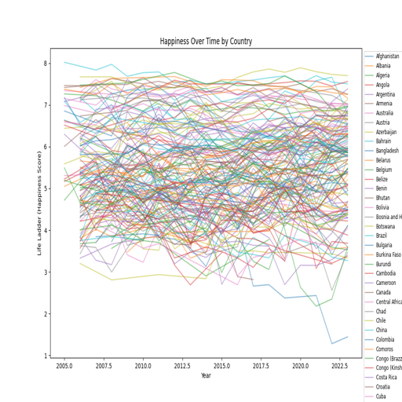
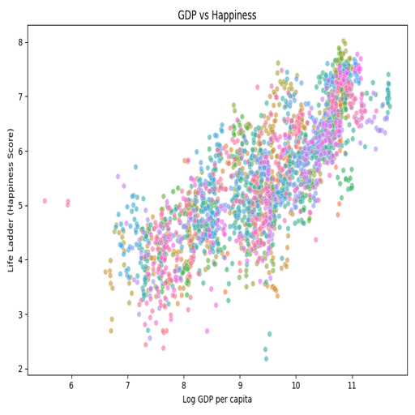
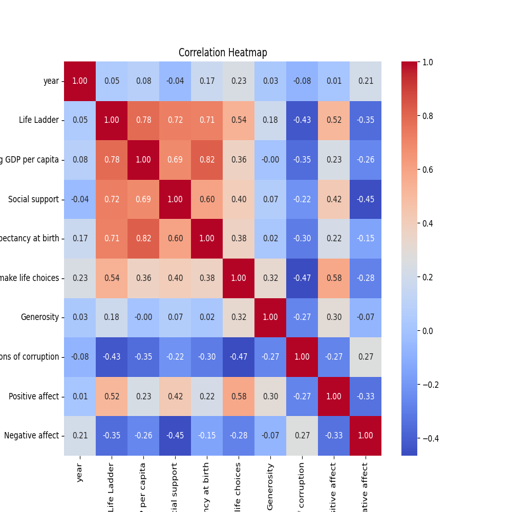

# Story of Happiness: An Analysis of Global Well-Being

## Introduction

In an era where mental health and well-being are at the forefront of global discussions, understanding the factors that influence happiness is vital. This analysis explores a dataset of happiness metrics from 2,363 entries spanning 11 features. These include indicators of life satisfaction and socioeconomic variables, measured across various years, with the goal of uncovering insights into global happiness trends, economic impacts, and social dynamics.

## Dataset Overview

The dataset includes the following columns:

- **Country name**: Identifier for each country.
- **Year**: The year of recorded data.
- **Life Ladder**: A subjective measure of well-being on a scale from 1 to 10.
- **Log GDP per capita**: A normalized logarithmic transformation of GDP per capita.
- **Social support**: Perceived support from family and friends.
- **Healthy life expectancy at birth**: Average years of expected healthy life at birth.
- **Freedom to make life choices**: A measure of personal freedom.
- **Generosity**: A measure of charitable behavior.
- **Perceptions of corruption**: Perceived corruption in government and business sectors.
- **Positive affect**: Presence of positive emotions.
- **Negative affect**: Presence of negative emotions.

## Data Quality and Cleaning

A preliminary data review revealed missing values in key columns:

- **Log GDP per capita**: 28 missing entries.
- **Social support**: 13 missing entries.
- **Healthy life expectancy at birth**: 63 missing entries.
- **Freedom to make life choices**: 36 missing entries.
- **Generosity**: 81 missing entries.
- **Perceptions of corruption**: 125 missing entries.
- **Positive affect**: 24 missing entries.
- **Negative affect**: 16 missing entries.

These gaps could introduce bias, particularly in data-scarce countries. Imputation techniques or exclusion of incomplete rows were considered to mitigate potential distortions in the analysis.

## Statistical Highlights

Descriptive statistics provided a snapshot of global well-being:

- **Life Ladder**: The mean score was 5.48, indicating moderate happiness levels.
- **Log GDP per capita**: The average score was 9.40, reflecting diverse economic conditions.
- **Healthy life expectancy at birth**: The mean was 63.4 years, revealing health disparities among nations.
- **Generosity**: The average score was 0.0001, suggesting minimal charitable behavior, likely influenced by cultural or economic constraints.

## Visualization Insights

To understand the dataset further, several visualizations were created:

### 1. Average Happiness by Country
This visualization ranked countries by their average Life Ladder scores. Wealthier nations tended to report higher happiness levels, aligning with expectations.

### 2. Happiness Over Time
This graph traced changes in happiness over the years for various countries. While some nations experienced steady growth, others showed fluctuations, possibly influenced by political or economic events.

### 3. GDP vs Happiness
A scatter plot revealed a positive correlation between GDP per capita and happiness. Beyond a certain income level, additional wealth showed diminishing returns on happiness, illustrating a non-linear relationship.

### 4. Happiness Correlation Heatmap
A heatmap visualized relationships among variables. Notable findings included:
- **Social support** and **Positive affect** strongly correlated with happiness.
- **Perceptions of corruption** negatively correlated with happiness, indicating trust as a key factor.

## Key Insights

Several important themes emerged:

- **Economic Prosperity**: Wealthier countries generally report higher happiness levels, but wealth alone does not guarantee well-being.
- **Social Dynamics**: Strong social support networks and positive emotions significantly boost happiness.
- **Trust in Institutions**: Low perceptions of corruption align with higher happiness, highlighting the importance of transparent governance.
- **Health and Freedom**: Healthy life expectancy and freedom to make life choices also contribute significantly to well-being.

## Implications

- **For Policymakers**: Investment in social infrastructure, health systems, and transparent governance can improve citizens' happiness.
- **For Researchers**: This dataset offers a rich basis for further exploration into regional and temporal patterns of well-being.
- **For Global Organizations**: Addressing economic disparities and promoting personal freedoms are crucial to enhancing global happiness.

## Conclusion

The analysis of global happiness metrics underscores the multifaceted nature of well-being. By understanding the interplay of economic, social, and governance factors, nations can better address the needs of their populations and foster a more content and equitable world.

## Visualizations

Below are the visualizations created during the analysis:

- 
- 
- 
- 
