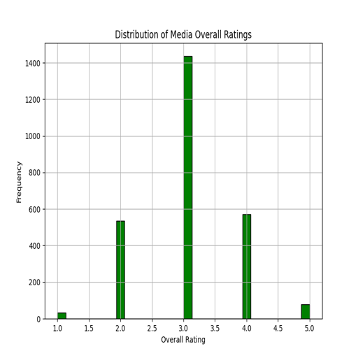
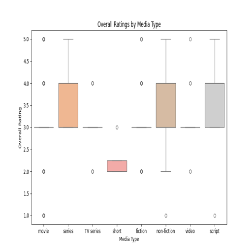
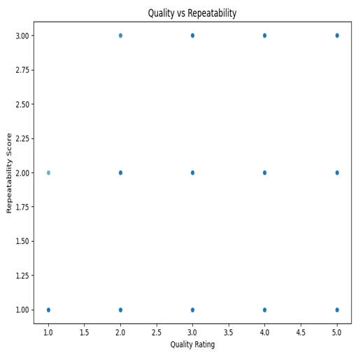
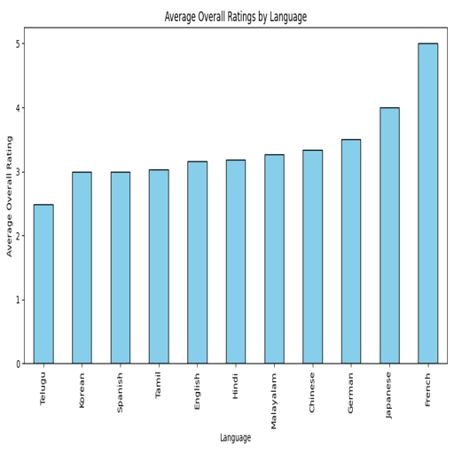
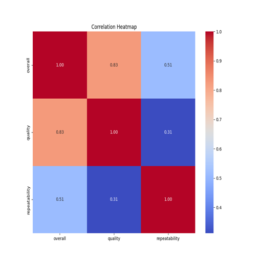

# Story of the Media Dataset Analysis

## Introduction

In the age of digital media, understanding audience preferences and content performance is essential for producers, marketers, and stakeholders in the entertainment industry. This analysis focuses on a media dataset containing information about various media entries, including movies, their ratings, and other qualitative attributes. The dataset comprises 2,652 entries across eight columns, capturing key factors such as date, language, type, title, contributors, overall ratings, quality ratings, and repeatability. 

## Dataset Overview

The dataset features the following columns:

- **Date**: The release date of the media.
- **Language**: The language in which the media was produced.
- **Type**: The category of the media (e.g., movie).
- **Title**: The name of the media.
- **By**: The contributors or actors involved in the media.
- **Overall**: A numerical rating reflecting the overall quality of the media.
- **Quality**: A numerical rating assessing the quality of the media.
- **Repeatability**: A numerical metric indicating how likely viewers are to revisit the media.

## Data Quality Assessment

Before diving into deeper analysis, it was essential to evaluate the data quality. Notably, the 'date' column had 99 missing values, while the 'by' column had 262 missing entries. This raises concerns about the completeness of the dataset, particularly regarding contributors, which could affect the accuracy of any insights drawn. However, other columns were complete, allowing us to conduct a robust analysis on the core ratings.

## Basic Statistics

The basic statistics provided a foundational understanding of the media entries:

- The **Overall Ratings** had a mean of approximately 3.05, with a standard deviation of 0.76. This suggests a moderate level of satisfaction among viewers, with ratings ranging from 1 to 5.
- The **Quality Ratings** showed a slightly higher mean of about 3.21, indicating a generally favorable perception of the media quality.
- **Repeatability** ratings averaged around 1.49, suggesting that most media entries are not highly revisited, with a maximum score of 3. 

The distribution of these ratings indicated that most entries clustered around the middle values, with minimal representation of the highest ratings, suggesting room for improvement in both overall and quality ratings.

## Visualization Insights

To further explore the dataset, several visualizations were created:

### 1. Media Ratings Distribution
This visualization illustrated the frequency of overall ratings, revealing a noticeable concentration around the middle values (3 and 4). This distribution suggests that while many media entries are satisfactory, there are relatively few standout works.

### 2. Media Ratings by Type
Here, we compared ratings across different types of media. This analysis shed light on which genres resonated more with audiences. For instance, if movies consistently received higher ratings than other types, it might indicate a preference within the dataset's viewing audience.

### 3. Quality vs. Repeatability
This scatter plot examined the relationship between the quality of media and its repeatability. A trend might reveal that higher quality ratings correlate with greater chances of viewers returning to the media, which is crucial for marketing strategies.

### 4. Media Average Ratings by Language
By breaking down average ratings by language, we could identify cultural preferences or biases affecting media perception. This analysis allows producers to tailor content more effectively to specific audiences.

### 5. Media Correlation Heatmap
This heatmap provided insights into the relationships among various numerical fields. Understanding how overall ratings correlate with quality and repeatability can inform content creation and promotion strategies.

## Key Insights

The analysis revealed several significant insights:

- **Audience Satisfaction**: The moderate ratings across the board suggest a need for improved media quality. Stakeholders should focus on enhancing production values and storytelling to elevate viewer satisfaction.
- **Content Strategy**: The preference for specific genres or languages can guide content development.
- **Engagement and Repeatability**: Higher quality ratings tend to encourage repeat viewership, emphasizing the importance of consistent quality production.
- **Cultural Considerations**: Language-based preferences highlight the need to consider cultural nuances in media creation and marketing.

## Implications

- **For Producers**: Prioritize high-quality production and storytelling to enhance ratings and repeatability.
- **For Marketers**: Leverage audience insights to promote content effectively across different cultural and linguistic demographics.
- **For Researchers**: This dataset serves as a valuable resource for studying media performance and audience engagement.

## Conclusion

The media dataset analysis underscores the importance of quality, audience alignment, and cultural considerations in driving success in the entertainment industry. By understanding the interplay of these factors, stakeholders can better cater to audience preferences and optimize content strategies.

## Visualizations

Below are the visualizations created during the analysis:

- 
- 
- 
- 
- 

